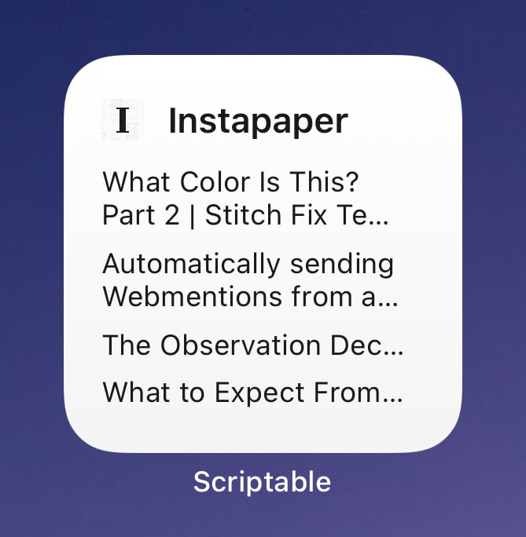
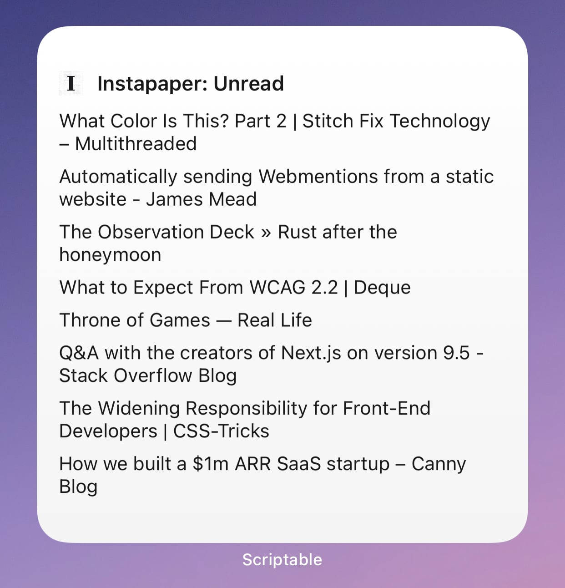
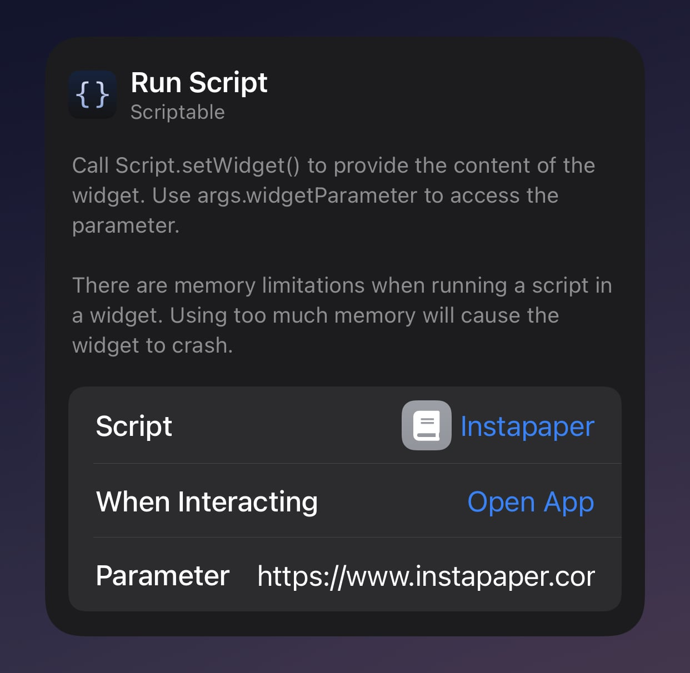

# Instapaper: Unread

This widget displays your recent unread articles from Instapaper. It uses your public RSS feed to display the unread items, and when you click them, it opens your default browser to read the article **NOT Instapaper** itself. If I figure out how to open that article directly in Instapaper, I will update this script.

### Small



### Medium


### Large



## Config

Your feed url can be found by visiting https://www.instapaper.com/u and finding the link when viewing the page source and search for `rss`.

```html
<link
  rel="alternate"
  type="application/rss+xml"
  title="RSS"
  href="/rss/123456/YzRvSlLTQDV1lz5OjjeEk4Ogl9d"
/>
```

Add `https://www.instapaper.com/` to the front of the `href` value which results in something like this:

```
https://www.instapaper.com/rss/123456/YzRvSlLTQDV1lz5OjjeEk4Ogl9d
```

Paste your RSS feed url into the widget parameter field when editing the widget.



You could also edit line 10 of the widget and hard-code this value..
