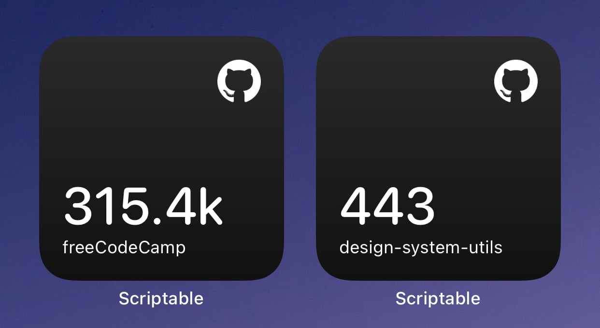
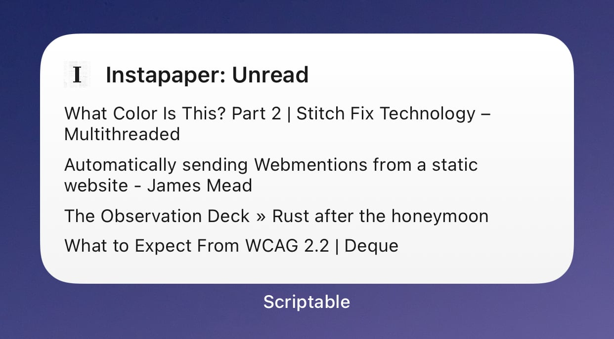
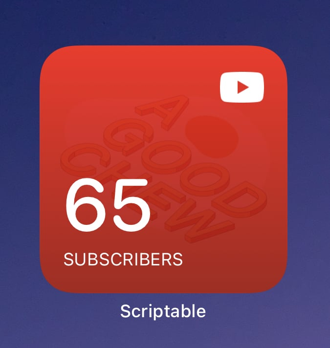
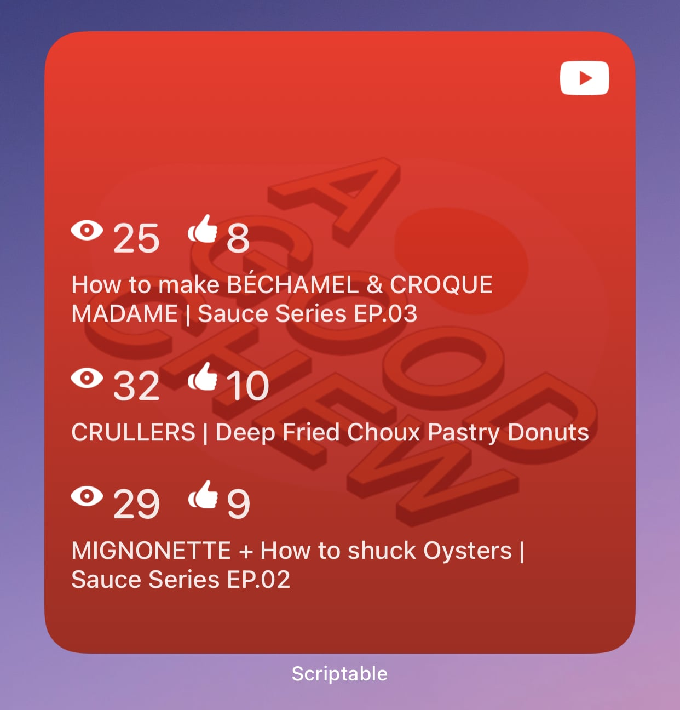

# Scriptable widgets

  

    
    
    
  

# GitHub repo star count

[More info](/GitHubRepoStats)

# Instapaper: Unread

Widget displays your recent unread articles from Instapaper.

[More info](/InstapaperUnread)

# Youtube Channel Stats

Two different widgets, one for showing your channel subscriber count, and another for showing stats about your channel's 3 most recent uploads.

[More info](/YoutubeChannelStats)

## Subscriber count

## Video stats

