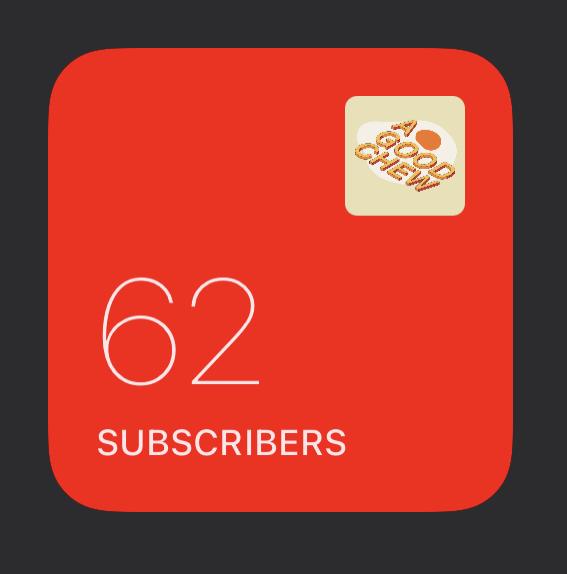
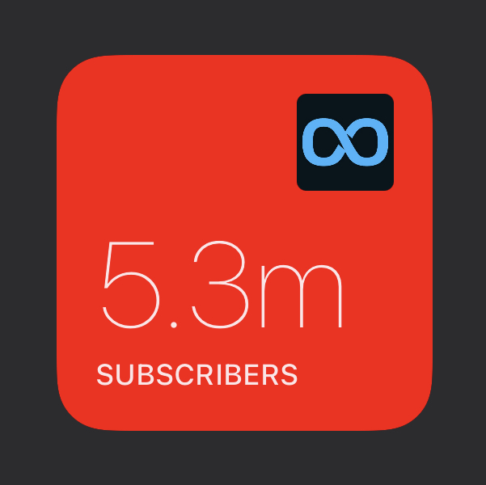

# YoutubeChannelStats

These widgets display information about a Youtube channel.

### Widget configuration

There are some variables at the top of the file that you will want to change.

```js
/**
 * WIDGET CONFIGURATION
 */
const YOUTUBE_CHANNEL_ID = 'your_channel_id' // required
const YOUTUBE_API_KEY = 'your_API_key' // required
const SHOW_CHANNEL_TITLE = true
const BG_COLOUR = '#ff0000' // Youtube Red
```

- `YOUTUBE_CHANNEL_ID` is the ID of the channel you want to display information about. You can find it from the url of the channel, e.g. for this channel: `https://www.youtube.com/channel/UCaeTwbBs3tezU9MUi25z5MQ`, `UCaeTwbBs3tezU9MUi25z5MQ` is the channel ID.
- The `YOUTUBE_API_KEY` value is an API key that **you** need to create in the [Google Developer Console](https://console.developers.google.com), you can find out how to do this from [here](https://developers.google.com/youtube/v3/getting-started)
- Set `SHOW_CHANNEL_TITLE` to `false` hide the channel title
- Set `DARK_BG_COLOUR` to change the background gradient when your phone is in dark mode
- Set `LIGHT_BG_COLOUR` to change the background gradient when your phone is in light mode

## Subscribers

File: `YoutubeChannelSubs+views.js`

This widget show both your channel subscriber count and total video views. Tapping on the widget will navigate to that Youtube channel.



The count display is formatted so that values with be abbreviated, like so:

- Count: `62`. Display: `62`
- Count: `623`. Display: `623`
- Count: `6230`. Display: `6.2k`
- Count: `62300`. Display: `62.3k`
- Count: `623000`. Display: `623k`
- Count: `6230000`. Display: `6.2m`
- Count: `62300000`. Display: `623m`
- Count: `623000000`. Display: `6.2b`

Here's an example for a Youtube channel with over 5 million subscribers.


